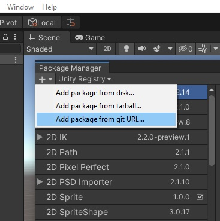
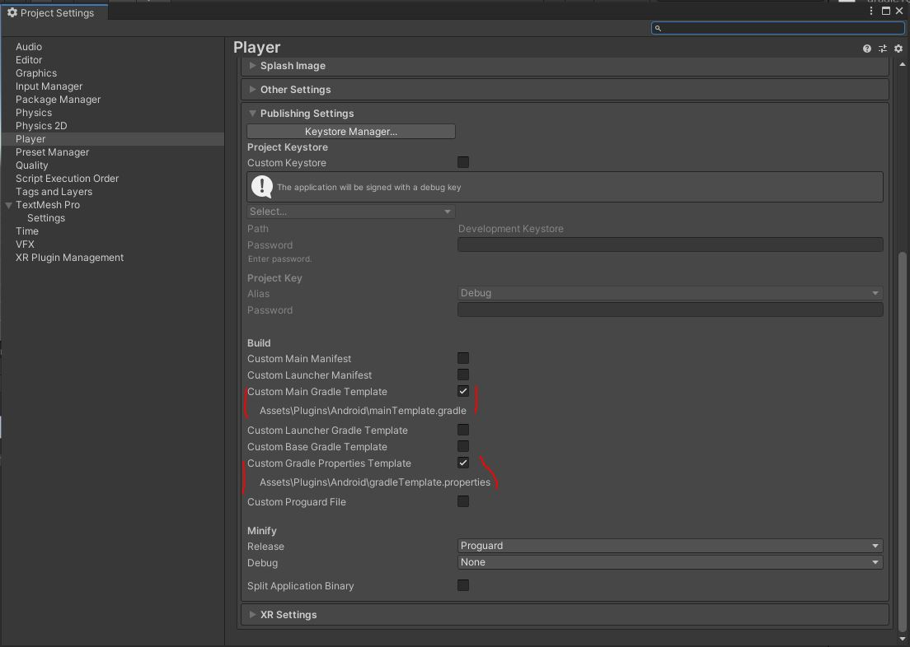

# ZarinPal In App Billing - Purchase SDK - Unity Plugin

This package provides the functionality of Payment through ZarinPal in Unity on Android

## Introduction

ZarinPal in-app purchases are the simplest solution to selling digital products or content on Android apps. So many app developers who want to sell digital goods or offer premium membership to users can simply use the it, in-app billing process for smooth and easy checkouts.

## Requirements

- Unity 2019.3 Or Later
- Android Target Platform installed for Unity

## Installation

You can install package either directly from Unity's Package Manager by git Url or by downloading this repo and Putting it under Packages folder of your project.

**By Git Url**

Open *Package Manager* ( Window -> Package Manager ). In Package Manager window click on the top-left button with + icon, choose *add package from git URL...* , enter or copy the following link ( `https://github.com/AliA74/ZarinPal-IAB-Unity-Plugin.git` )

**Embedding in the project**

If you don't want to use the previous method for installing the package, You can do the following:

1. create a folder titled `com.zarinpal.iab` under Packages folder inside the root folder of your project.
2. clone/download this repository and put all the content inside the folder you created at previous step (`com.zarinpal.iab`)

## Setup

This package requires some setup before it can be used correctly on Android. Make sure active build target is Android in Unity before continuing.

#### Step 1

Open **Player Settings** (Edit -> Project Settings -> Player). Select *Android Settings* then select *Publishing Settings*. Check both **Custom Main Gradle Template** and **Custom Gradle Properties Template**

